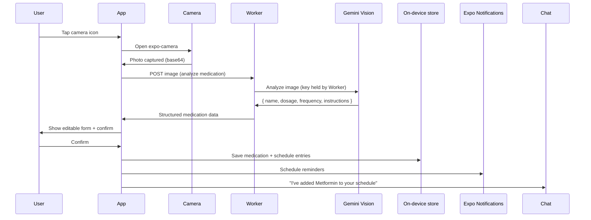
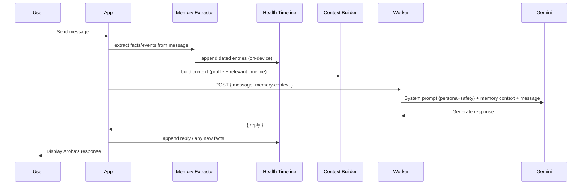
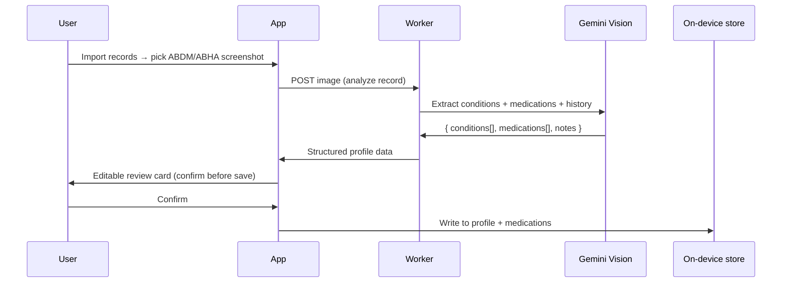
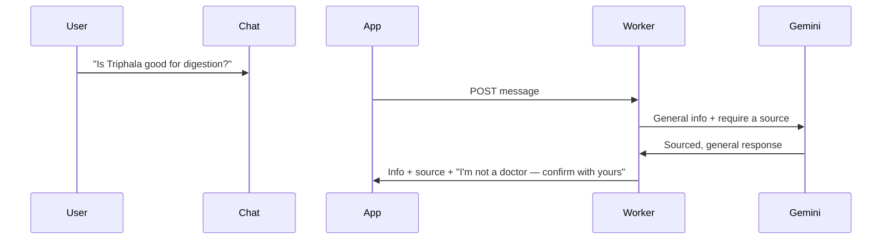

# Aroha AI — System Architecture

## 1. High-Level Architecture

```
┌─────────────────────────────────────────────────┐
│              React Native (Expo) App              │
│                                                   │
│  ┌──────────┐  ┌────────────┐  ┌──────────────┐  │
│  │  Chat UI   │  │  Schedule   │  │  Camera/Media │  │
│  │ (FlatList) │  │  (day list) │  │  (expo-camera)│  │
│  └─────┬─────┘  └─────┬──────┘  └───────┬───────┘  │
│        │               │                 │           │
│  ┌─────┴───────────────┴─────────────────┴────────┐ │
│  │        On-device storage (no cloud DB)          │ │
│  │   AsyncStorage / expo-sqlite: profile, meds,    │ │
│  │   schedule, symptoms, messages                  │ │
│  └─────────────────────────────────────────────────┘ │
│  ┌─────────────────────────────────────────────────┐ │
│  │   Expo Modules: expo-notifications │ expo-router │ │
│  └─────────────────────────────────────────────────┘ │
└───────────────────────────┬───────────────────────────┘
                            │  HTTPS (message / image + history)
                            ▼
┌────────────────────────────────────────────────────────┐
│         Cloudflare Worker  (aroha-proxy)                 │
│   • Holds the GEMINI_API_KEY as a secret                 │
│   • Injects Aroha persona + safety rules                 │
│   • Forwards to Gemini; returns reply / structured data  │
└───────────────────────────┬──────────────────────────────┘
                            │
                            ▼
                  ┌──────────────────┐
                  │  Google Gemini    │
                  │   API 1.5 Flash   │
                  │  Vision + Text   │
                  └──────────────────┘
```

**No Firebase in the MVP.** Data lives on the device; the only server is a tiny Cloudflare Worker whose sole job is to hold the Gemini key. Accounts + cloud sync are roadmap.

## 2. Data Architecture

### Data model (on-device; MVP)

> Stored locally via AsyncStorage / expo-sqlite. The paths below are **logical
> collections** describing the data shapes — in the MVP they're local records
> keyed to a single on-device profile. The same shapes map to a cloud schema
> when accounts + sync ship (roadmap).

```
/users/{uid}
├── demographics: {
│     name: string,
│     age: number,
│     gender: "male" | "female" | "other",
│     language: "en" | "hi"
│   }
├── conditions: [
│     {
│       name: string,
│       diagnosedDate: timestamp,
│       doctorId?: string,
│       notes?: string
│     }
│   ]
├── preferences: {
│     wakeTime: string ("HH:mm"),
│     mealTimes: { breakfast, lunch, dinner }: string,
│     reminderStyle: "gentle" | "firm" | "minimal",
│     smartMode: boolean,
│     theme: "light" | "dark" | "high-contrast"
│   }
├── streaks: {
│     current: number,
│     longest: number,
│     lastActiveDate: string (YYYY-MM-DD)
│   }
├── onboardingComplete: boolean,
├── createdAt: timestamp,
└── updatedAt: timestamp

/users/{uid}/medications/{medId}
├── name: string,
├── dosage: string ("500mg"),
├── form: "tablet" | "capsule" | "liquid" | "injection" | "cream",
├── frequency: "once_daily" | "twice_daily" | "thrice_daily" | "weekly" | "as_needed",
├── times: ["08:00", "20:00"],
├── withFood: boolean,
├── specialInstructions: string,
├── photoUrl: string (Storage URL of prescription photo),
├── isActive: boolean,
├── refillDate?: timestamp,
├── prescribedBy?: string (doctor name),
├── notes?: string,
├── createdAt: timestamp,
└── updatedAt: timestamp

/users/{uid}/schedule/{eventId}
├── date: string (YYYY-MM-DD),
├── time: string (HH:mm),
├── title: string,
├── type: "medication" | "meal" | "exercise" | "appointment" | "symptom_check" | "custom",
├── medId?: string (FK to medications if type=medication),
├── description?: string,
├── completed: boolean,
├── notificationOn: boolean,
├── notificationSent: boolean,
├── recurrence?: {
│     type: "daily" | "weekly" | "weekdays" | "weekends" | "custom" | "date_range" | "none",
│     daysOfWeek?: number[] (0-6, 0=Sunday),
│     startDate?: string (YYYY-MM-DD),
│     endDate?: string (YYYY-MM-DD),
│     interval?: number (every N days)
│   },
├── recurrenceGroupId?: string (events from same recurrence share this),
├── createdAt: timestamp,
└── updatedAt: timestamp

/users/{uid}/symptoms/{symptomId}
├── date: timestamp,
├── description: string,
├── bodyPart: string,
├── severity: number (1-5),
├── photoUrls: string[],
├── aiAnalysis: string,
├── notes?: string,
├── resolved: boolean,
├── resolvedDate?: timestamp,
├── createdAt: timestamp,
└── updatedAt: timestamp

/users/{uid}/conversations/{convId}
├── title?: string (auto-generated),
├── messages: [
│     {
│       role: "user" | "assistant" | "system",
│       content: string,
│       timestamp: timestamp,
│       metadata?: {
│         type: "text" | "image" | "medication_result" | "verification_result",
│         imageUrl?: string,
│         sourceUrl?: string
│       }
│     }
│   ],
├── summary?: string,
├── messageCount: number,
├── createdAt: timestamp,
└── updatedAt: timestamp

/users/{uid}/memory/{section}
├── (dynamic sections):
│   ├── conversationSummaries: [
│   │     { period: string, summary: string, createdAt: timestamp }
│   │   ],
│   ├── learnedFacts: [
│   │     { fact: string, source: string, timestamp: timestamp }
│   │   ],
│   ├── healthTimeline: [
│   │     { date: timestamp, event: string, type: string }
│   │   ],
│   └── userPreferences: {
│         communicationStyle: string,
│         knownAllergies: string[],
│         avoidedTopics: string[],
│         personalDetails: { key: string, value: string }[]
│       }
└── updatedAt: timestamp

// ▼▼▼ ROADMAP SCHEMA — NOT built in v1. Designed ahead for the caregiver feature. ▼▼▼
/users/{uid}/caregivers/{cgUid}
├── relationship: "son" | "daughter" | "spouse" | "other",
├── canMonitor: boolean,
├── canAlert: boolean,
├── alertPreferences: {
│     missedCriticalMeds: boolean,
│     lowAdherence: boolean,
│     emergencyOnly: boolean
│   },
├── addedAt: timestamp,
└── verified: boolean

/caregivers/{cgUid}/linkedUsers/{uid}
├── relationship: string,
├── adherenceSummary: {
│     todayCompleted: number,
│     todayTotal: number,
│     weeklyAverage: number,
│     streaks: number
│   },
├── lastActivity: timestamp,
└── linkedAt: timestamp
// ▲▲▲ END ROADMAP SCHEMA ▲▲▲
```

### Storage Structure

```
/photos/{uid}/
├── medications/{medId}_{timestamp}.jpg
├── symptoms/{symptomId}_{timestamp}.jpg
└── profile/{timestamp}.jpg
```

## 3. Key Data Flows

### Flow 1: Camera → Medication



### The Health Memory Layer (core architecture)

Aroha's distinguishing component. Every input runs through the same three on-device stages, so Gemini reasons over accumulated memory rather than a single message:

```
 Inputs (chat, camera→meds, ABHA import, symptoms, dose completions)
        │
        ▼
 ┌─────────────────┐   extract structured facts/events from each interaction
 │ Memory Extractor│──────────────────────────────────────────────────────┐
 └─────────────────┘                                                       │
        │ appends                                                          │
        ▼                                                                  │
 ┌─────────────────┐   append-only, dated log of health events            │
 │ Health Timeline │   (on-device: expo-sqlite)                           │
 └─────────────────┘                                                       │
        │ reads                                                            │
        ▼                                                                  │
 ┌─────────────────┐   profile + relevant recent timeline → prompt context│
 │ Context Builder │◄─────────────────────────────────────────────────────┘
 └─────────────────┘
        │ context
        ▼
   Worker → Gemini reasoning → personalized reply / action
```

### Flow 2: Chat Message → AI Response (through the Memory Layer)



### Flow 1b: ABDM / Record Screenshot → Profile (reuses the Vision pipeline)



### Flow 3: Health Q&A (stretch — info only, NOT interaction checking)



> **Note:** v1 does **not** cross-reference the user's medications for interactions or judge whether a prescription/medicine is "good." That capability is Vision/roadmap only, and even then framed as advocacy ("ask your doctor about…"), never as a verdict. See PRD §5b.

## 4. Server (Cloudflare Worker)

One Worker (`aroha-proxy`) holds the Gemini key and exposes a single POST endpoint. The app sends an `intent` (or the Worker infers from payload) and gets structured JSON back. All "functions" are handlers inside this one Worker — there is no Firebase.

| Handler | Input (POST body) | Output | Purpose |
|---|---|---|---|
| chat | `{ message, history }` | `{ reply }` | Persona + safety-wrapped Gemini text (built in scaffold) |
| analyzeMedication | `{ image }` | `{ name, dosage, frequency, times, instructions }` | Gemini Vision → med data (HERO) |
| analyzeRecord | `{ image }` | `{ conditions[], medications[], notes }` | Gemini Vision → ABDM/record import (same pipeline) |
| generateDoctorSummary | `{ profile, adherence, symptoms }` | `{ summary }` | Pre-visit summary (symptoms + adherence + questions) |
| analyzeSymptom *(P1)* | `{ image }` | `{ description }` | Gemini Vision → symptom **log** (describe, not diagnose) |

The Worker always injects Aroha's persona + hard safety rules ("advocate, never override"). Doctor-summary composition and memory context are assembled **on-device** from local data, then sent to the Worker — no cloud DB needed.

**Roadmap (do NOT build for v1):** a `reviewPrescription` handler (advocacy only — never "this is wrong / stop it"), server-push reminders (v1 uses local notifications), and a caregiver digest (requires explicit opt-in + accounts).

## 5. Security & Privacy

### MVP model — on-device + key proxy

- **Gemini key** lives ONLY in the Cloudflare Worker as a secret (`wrangler secret put GEMINI_API_KEY`). It is never in the app bundle, `.env`, or the public repo.
- **Health data** stays on the device (AsyncStorage / expo-sqlite). There is no shared cloud database in the MVP, so there is no server-side store to breach or misconfigure.
- **Minimal exposure to Google:** only the specific message/image needed for one inference is sent to Gemini (via the Worker); nothing is retained by us.
- **Worker hardening:** validates input, POST-only, and can add rate-limiting / an app token before public launch (roadmap).

### Roadmap — cloud sync security (when accounts ship)

The planned sync approach is **Google Sign-In + the user's own Google Drive** (`appDataFolder`): the app backs up a JSON snapshot to the user's Drive and restores it on a new device. This keeps the "we store nothing" posture — health data lives on the device and in the user's own Drive, never in a database we run. If a managed cloud store is added later, per-user isolation would be enforced at the storage layer (e.g. row/collection-level auth). Draft rules for that alternative future model:

```javascript
// ROADMAP — applies only once cloud sync + auth exist. Not in MVP.
rules_version = '2';
service cloud.firestore {
  match /databases/{database}/documents {
    match /users/{userId}/{document=**} {
      allow read, write: if request.auth != null && request.auth.uid == userId;
    }
  }
}
```

## 6. Key Libraries & Dependencies

**v1 (core):**

| Package | Purpose |
|---|---|
| `expo` ~52 | React Native framework (Android-first) |
| `expo-router` | File-based navigation |
| `expo-camera` | Camera capture for medications/symptoms |
| `expo-image-picker` | Gallery import (pill photos + ABDM screenshots) |
| `expo-notifications` | Local reminders |
| `@react-native-async-storage/async-storage` | On-device key-value storage |
| `expo-sqlite` | On-device structured data (schedule, meds, messages) |
| `react-native-reanimated` | Animations |
| `date-fns` | Date manipulation |
| *(server)* `wrangler` | Deploy the Cloudflare Worker key proxy |

**Stretch / roadmap (not core):**

| Package | Purpose | Tier |
|---|---|---|
| `expo-speech` | TTS for Smart Mode | Stretch |
| `@react-native-voice/voice` | Speech-to-text | Stretch |
| `react-native-calendars` | Month-grid view | Stretch (v1 uses a simple day list) |
| `victory-native` | Adherence charts | Roadmap (caregiver dashboard) |

## 7. Performance Targets

| Metric | Target |
|---|---|
| AI response time | < 3 seconds (Gemini 1.5 Flash) |
| Camera → medication result | < 5 seconds |
| App cold start | < 3 seconds |
| Chat history load (50 msgs) | < 1 second |
| Schedule/day view load | < 500ms |
| Local reminder fires | At scheduled time (expo-notifications) |
| Offline data access | Instant — data is on-device, so viewing/editing works with no network |
| Image upload (1MB) | < 3 seconds |
